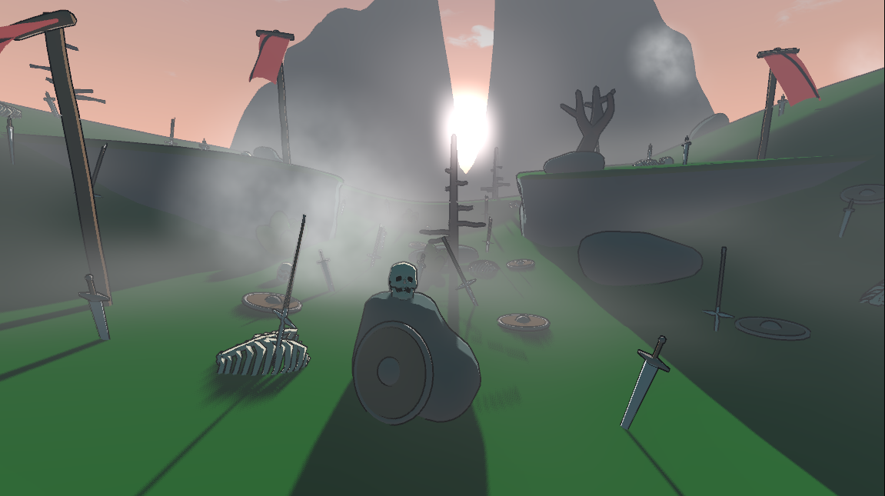

# Godot 4 Complete Cel Shader

This project is a demo of my Cel Shader for Godot 4. This is a continuation of [this project](https://godotshaders.com/shader/complete-toon-shader/), the old version of this shader for Godot 3. Feel free to mess around with it and study!

[godotshaders.com link](https://godotshaders.com/shader/complete-cel-shader-for-godot-4/)

[Youtube video](https://youtu.be/F0LZ_hAci4k)

## Instructions

You need to put everything on the [src](src) folder on your project, on the same folder. Then, go to Project Settings > Shader Globals and set the following:

```
sampler2D diffuse_curve
float specular_smoothness = 0.05
float fresnel_smoothness = 0.05
float outline_width = 4
color outline_color = black
```

These values are the ones that made this screenshot you're seeing, but feel free to mess around with these values.

The `diffuse_curve` texture must also be set. You can put a texture you already have or you can use Godot's built in `GradientTexture1D` or `CurveTexture` types, but *you must save them as resources* or else the engine won't be able to load them the next time you open Godot. The one I used for this demo is [this one](demo/texture/diffuse-texture.tres) saved from a `GradientTexture1D` resource, so you can use this one to get a scene looking exactly like the one in the demo. I explain its functionality more in detail on [the previous video](https://youtu.be/Y3tT_-GTXKg).

### Base Materials

Whenever you want a material with one of the additional features, make a copy of [cel-shader-base.gdshader](src/cel-shader-base.gdshader) and change the defines.


This is how the defines look on [cel-shader-base.gdshader](src/cel-shader-base.gdshader). For each feature you want, change the `0` to `1` and the additional uniforms should show up on the material. You must have the [includes](src/includes) folder on the same directory as the your modified copy. You can see the demo as an example.

Lastly, you can watch the [Youtube video](https://youtu.be/F0LZ_hAci4k) for more information on how the base functions work and how to set it up.

### Outlines

Make another material with the [outline.gdshader](src/outline.gdshader) shader. Put this material on the `next_pass` property of the material.

## Changelog

- **October 8, 2025** <br/> Update to latest Godot version.

- **April 24, 2024** <br/> Add diffuse_curve global shader parameter (Thanks to Urakaroo).

- **Nov 7, 2023** <br/> Fix mountain shadows.

- **Nov 2, 2023** <br/> Fix broken material dependencies.

- **Sep 19, 2023** <br/> Fix the SPECULAR_AMOUNT variable name being already used.

- **Apr 24, 2023** <br/> Add the outlines code to the source and add instructions on how to set them up.

- **Apr 12, 2023** <br/> Update shadow settings (Thanks to Dustin Jablonski).

- **Apr 7, 2023** <br/> Initial release.

## License

All code is licensed under the [MIT](https://opensource.org/license/mit/) license.

## Credits

Shader, demo and assets by me, [Rafael Bordoni](https://github.com/eldskald). The skybox shader is [this one](https://godotshaders.com/shader/stylized-sky-shader-with-clouds/), by [axilirate](https://godotshaders.com/author/axilirate/). The fog shader is [this one](https://godotshaders.com/shader/moving-gradient-noise-fog-mist-for-godot-4/), by [alghost](https://godotshaders.com/author/alghost/).

